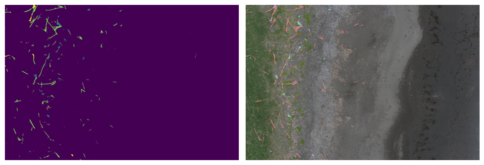

# Чистый берег: нейросетевая модель обнаружения мусора

**Чистый берег** - нейросетевая модель, которая умеет определять объём, массу и виды мусора на побережьях водоёмов. Решение успешно применили в экологической экспедиции в Южно-Камчатском федеральном заказнике – особо охраняемой природной территории под управлением ФГБУ «Кроноцкий государственный заповедник» на Дальнем Востоке, а также тестируют в Арктике и других регионах.

Нейросеть анализирует аэрофотоснимки побережья и делит мусор на шесть классов:
* рыболовные сети
* железо
* резина
* крупный пластик
* бетон
* древесина

Достигнутая точность классификации модели – выше 80%. Модель отмечает координаты расположения мусора на карте, которая затем доступна в приложении QGIS, указывает его состав и вес. Эти данные помогают рассчитать размер необходимой группы людей и количество техники для уборки. 

Модель обучена на датасете снимков побережья Арктики, Байкала, Камчатки.

## Что в репозитории

В данном репозитории содержится:
* [Код для предобработки данных](model-training/data-preparation.ipynb) и [обучения нескольких классов моделей сегментации](model-training/models-training.ipynb). В экспериментах использовались архитектура UNet, SegFormer.
* [Пример](example/run-model.ipynb) запуска модели сегментации мусора. 
* [Код сервера для запуска модели сегментации в облаке](model-server/README.md)
* [Плагин для QGIS](qgis-plugin/litter_map)

Другие инструменты, разработанные в рамках проекта:
* [Облачный инструмент для разметки датасета с помощью кликовой сегментации](https://gitlab.com/combat_helicopter/clicksegmenter_cloud_version)
* [Генератор синтетичесого датасета на основе StarGAN V2](https://gitlab.com/combat_helicopter/stargan-v2-masked-generation)
* [Генератор синтетического датасета на основе преобразования Фурье и пирамид Лапласа](https://gitlab.com/combat_helicopter/laplaciangenerator)
* Авторазметка стилей: [1](https://gitlab.com/combat_helicopter/automaticstylemarking),
[2](https://gitlab.com/combat_helicopter/maskedautomaticstylemarking)

Сама обученная модель сегментации мусора находится [здесь](https://storage.yandexcloud.net/socialtech/garbage-detect/seg-model/model.pt).

> В рамках проекта мы не предоставляем датасет, на котором была обучена модель, из-за лицензионных ограничений. Посмотреть на пример данных, на которых была обучена модель, вы можете в [публичном дашбоарде Yandex Datalens](https://datalens.yandex/osp1sv4o5f4ca). Вы можете использовать [обученную в рамках проекта модель сегментации](https://storage.yandexcloud.net/socialtech/garbage-detect/seg-model/model.pt) на своих данных ([пример](example/run_model.ipynb)). Если же вы хотите обучить модель на своём датасете - используйте код из директории [`model-training`](model-training)
